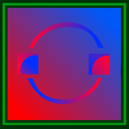

# Image Train Filters For Android

[](https://github.com/jesperancinha/image-train-filters-android)
[](https://github.com/jesperancinha/image-train-filters-android/releases)

[](https://circleci.com/gh/jesperancinha/image-train-filters-android)
[](https://github.com/jesperancinha/image-train-filters-android/actions/workflows/image-train-filters-android.yml)

[](https://www.codacy.com/manual/jofisaes/image-train-filters-android?utm_source=github.com&amp;utm_medium=referral&amp;utm_content=jesperancinha/image-train-filters-android&amp;utm_campaign=Badge_Grade)
[](https://codebeat.co/projects/github-com-jesperancinha-image-train-filters-android-master)
[](https://bettercodehub.com/)

[](https://www.codacy.com/gh/jesperancinha/image-train-filters-android/dashboard?utm_source=github.com&utm_medium=referral&utm_content=jesperancinha/image-train-filters-android&utm_campaign=Badge_Coverage)
[](https://coveralls.io/github/jesperancinha/image-train-filters-android?branch=master)
[](https://codecov.io/gh/jesperancinha/image-train-filters-android)

[]()
[]()
[]()

This application started in 2015 with name [Chartizate App](https://play.google.com/store/apps/details?id=com.steelzack.chartizateapp). In the meantime it's content has changed so much and als it's goals that I've renamed it to Image Train Filters just as my website. It's not currently available as such but it will work just like the [site](http://itf.joaofilipesabinoesperancinha.nl/), but in an app format. Find more info about the [site](http://itf.joaofilipesabinoesperancinha.nl/) in the description below. Please read my privacy policy listed in [Privacy Policy](Privacy_Policy.md).





This application supports only devices from version Android SDK 24 (Nougat). This has solely to do with the fact that only from this version onwards there is support for Java 8 streams.

## Requirements

-   Java 8
-   Android SDK 24, code name Nougat (7.0.0)

## Build Info

The app currently uses a color picker from:

> - https://github.com/QuadFlask/colorpicker

## Buid

```shell
gradle wrapper --gradle-version 7.3.3
```

```text
gradle wrapper

./gradlew assembleRelease
```

## Status

***Under development***

## References

-   [<activity>](https://developer.android.com/guide/topics/manifest/activity-element#exported)

## About me

[](http://joaofilipesabinoesperancinha.nl)
[](https://github.com/jesperancinha)
[](https://masto.ai/@jesperancinha)
[](https://twitter.com/joaofse)
| [Sessionize](https://sessionize.com/joao-esperancinha/)
| [Spotify](https://open.spotify.com/user/jlnozkcomrxgsaip7yvffpqqm?si=b54b89eae8894960)
| [Medium](https://medium.com/@jofisaes)
| [YouTube](https://www.youtube.com/@joaoesperancinha/featured)
| [Instagram](https://www.instagram.com/joaofisaes/)
| [Buy me a coffee](https://www.buymeacoffee.com/jesperancinha)
| [Credly Badges](https://www.credly.com/users/joao-esperancinha)
| [Google Apps](https://play.google.com/store/apps/developer?id=Joao+Filipe+Sabino+Esperancinha)
| [Sonatype Search Repos](https://search.maven.org/search?q=org.jesperancinha)
| [Docker Images](https://hub.docker.com/u/jesperancinha)
| [Stack Overflow Profile](https://stackoverflow.com/users/3702839/joao-esperancinha)
| [Reddit](https://www.reddit.com/user/jesperancinha/)
| [Dev.TO](https://dev.to/jofisaes)
| [Hackernoon](https://hackernoon.com/@jesperancinha)
| [Code Project](https://www.codeproject.com/Members/jesperancinha)
| [BitBucket](https://bitbucket.org/jesperancinha)
| [GitLab](https://gitlab.com/jesperancinha)
| [Coursera](https://www.coursera.org/user/da3ff90299fa9297e283ee8e65364ffb)
| [FreeCodeCamp](https://www.freecodecamp.org/jofisaes)
| [HackerRank](https://www.hackerrank.com/jofisaes)
| [LeetCode](https://leetcode.com/jofisaes)
| [Codebyte](https://coderbyte.com/profile/jesperancinha)
| [CodeWars](https://www.codewars.com/users/jesperancinha)
| [Code Pen](https://codepen.io/jesperancinha)
| [Hacker Earth](https://www.hackerearth.com/@jofisaes)
| [Khan Academy](https://www.khanacademy.org/profile/jofisaes)
| [Hacker News](https://news.ycombinator.com/user?id=jesperancinha)
| [InfoQ](https://www.infoq.com/profile/Joao-Esperancinha.2/)
| [LinkedIn](https://www.linkedin.com/in/joaoesperancinha/)
| [Xing](https://www.xing.com/profile/Joao_Esperancinha/cv)
| [Tumblr](https://jofisaes.tumblr.com/)
| [Pinterest](https://nl.pinterest.com/jesperancinha/)
| [Quora](https://nl.quora.com/profile/Jo%C3%A3o-Esperancinha)
| [VMware Spring Professional 2021](https://www.credly.com/badges/762fa7a4-9cf4-417d-bd29-7e072d74cdb7)
| [Oracle Certified Professional, Java SE 11 Programmer](https://www.credly.com/badges/87609d8e-27c5-45c9-9e42-60a5e9283280)
| [Oracle Certified Professional, JEE7 Developer](https://www.credly.com/badges/27a14e06-f591-4105-91ca-8c3215ef39a2)
| [IBM Cybersecurity Analyst Professional](https://www.credly.com/badges/ad1f4abe-3dfa-4a8c-b3c7-bae4669ad8ce)
| [Certified Advanced JavaScript Developer](https://cancanit.com/certified/1462/)
| [Certified Neo4j Professional](https://graphacademy.neo4j.com/certificates/c279afd7c3988bd727f8b3acb44b87f7504f940aac952495ff827dbfcac024fb.pdf)
| [Deep Learning](https://www.credly.com/badges/8d27e38c-869d-4815-8df3-13762c642d64)
| [](https://github.com/JEsperancinhaOrg)
[](https://joaofilipesabinoesperancinha.nl/badges)
[](https://github.com/jesperancinha/project-signer/blob/master/project-signer-quality/Build.md)
